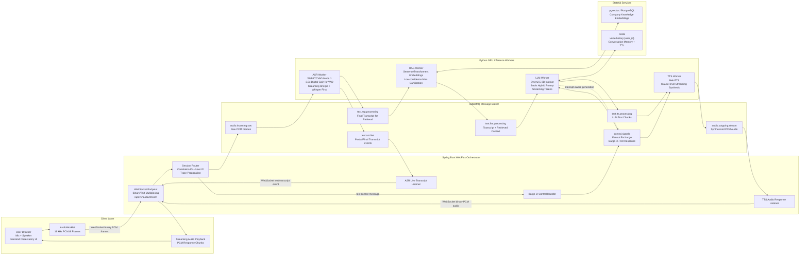

# JarvisLabs Real-Time Voice Assistant

**Live Demo URL:** Generated during review window on request -https://costs-assure-experience-map.trycloudflare.com/ 
**Demo Video Link:** [Add demo video link here]  
**Sample Audio Clip:** [Add sample audio clip link here]

The live demo URL is activated during the review window because GPU inference runs on a paid JarvisLabs L4 instance. For no-domain review access, start the stack on the L4 VM and run `cloudflared tunnel --url http://localhost:80`; the generated HTTPS URL becomes the temporary live reviewer link while the VM and tunnel are running.

JarvisLabs Real-Time Voice Assistant is a submission for the **Real-time voice assistant using open models** assignment. It is built as a distributed, interruptible voice system rather than a turn-based text chatbot wrapped in a microphone UI.

## What It Does

This project is an end-to-end real-time voice assistant that lets a user speak through a browser microphone and hear a spoken response without manually moving between ASR, LLM, and TTS stages. The assistant is grounded with retrieval-augmented generation over JarvisLabs support knowledge, keeps short-term conversation memory in Redis, and supports barge-in so the user can interrupt an answer mid-stream. The pipeline uses open models across ASR, reasoning, retrieval embeddings, and TTS.

## Why I Built This

I built this to move beyond the easy version of AI assistants: turn-based text chat. Real voice interaction exposes the harder systems problems: raw streaming audio I/O, low-latency WebSocket delivery, blocking GPU inference loops, concurrent queue routing, interruption control, partial transcripts, final transcript correction, RAG misses, memory persistence, and TTS chunking. The goal was to build something closer to a production voice loop, where the assistant listens, thinks, speaks, and can be interrupted naturally.

## Demo Transcript & Fallback

**Fallback sample audio:** [Add sample audio clip link here]

Expected behavior from a short demo session:

```text
User: Hello.
Jarvis: Hello.

User: Can you tell me about JarvisLabs?
Jarvis: JarvisLabs is a cloud GPU platform for AI workloads like notebooks, model training, inference, and deployment.

User: What is the minimum GPU for a small LLM project on JarvisLabs?
Jarvis: For small LLM projects, the NVIDIA L4 is a good starting point. For exact pricing and current availability, check the live JarvisLabs dashboard.

User: Who is the lead operator of yours?
Jarvis: I do not have a specific operator name available. I can still help with JarvisLabs GPU, billing, deployment, and troubleshooting questions.

User: Thank you.
Jarvis: You're welcome.
```

This transcript demonstrates greeting fast paths, RAG-grounded JarvisLabs support knowledge, graceful handling of unavailable company-specific facts, and conversational closing.

## Architecture



## Models Used

| Component | Model / Library | Role |
|---|---|---|
| Final ASR | Faster-Whisper `small.en` on CUDA float16 | Produces corrected final transcripts for LLM/RAG turns. |
| Live ASR | Sherpa ONNX streaming Zipformer | Provides streaming ASR behavior and partial transcript support. |
| VAD | WebRTCVAD mode 1 with 3.0x digital gain | Detects speech boundaries while preserving quiet/normal speech. |
| LLM | `Qwen/Qwen2.5-3B-Instruct`, 8-bit quantized | Conversational reasoning, support answers, and general fallback. |
| TTS | MeloTTS | Converts LLM text chunks into spoken audio. |
| Embeddings | `sentence-transformers/all-MiniLM-L6-v2` | Embeds company knowledge for pgvector retrieval. |
| Memory | Redis | Stores `voice:history:{user_id}` conversation turns with TTL. |
| Vector DB | pgvector / PostgreSQL | Stores embedded RAG chunks for JarvisLabs support knowledge. |

## Latency Measurements

These values were measured from the live browser frontend after deploying through the `frontend-proxy` service and Cloudflare Tunnel on a JarvisLabs L4 instance. `Speech-End TTFB` measures from detected speech end to the first received assistant audio frame. `Turn Response Latency` in the UI means speech end to the latest streamed audio received so far, so it grows while a longer answer is still playing.

| Scenario / Stage | Measured Latency |
|---|---:|
| Greeting, speech end to first spoken response | 2.26 s |
| Courtesy reply, speech end to first spoken response | 2.52 s |
| RAG-grounded JarvisLabs question, speech end to first spoken response | 3.86 s |
| RAG-grounded JarvisLabs question, speech end to latest streamed audio | 5.45 s |
| Long answer, speech end to first spoken response | 3.23 s |
| Long answer, full streamed response completion | 11.6 s |


## What I Did To Reduce Latency

- **8-bit LLM quantization:** Qwen2.5-3B-Instruct is loaded with bitsandbytes 8-bit quantization to reduce GPU memory pressure and improve responsiveness.
- **AMQP decoupling:** RabbitMQ separates WebSocket I/O from blocking Python GPU inference loops, so ASR, RAG, LLM, and TTS can run independently.
- **Voice activity tuning:** WebRTCVAD mode 1, a low RMS floor, minimum speech duration, and pre-roll buffering reduce false drops while keeping turn detection responsive.
- **Digital microphone gain:** Incoming PCM16 frames are amplified by 3.0x for VAD only, allowing quieter speech to pass speech gating without corrupting the final Whisper audio path.
- **Final ASR pause tuning:** The deployed stack uses `ASR_TRAILING_SILENCE_MS=1350` to reduce post-speech waiting time without making normal sentence pauses too brittle.
- **Streaming token delivery:** The LLM publishes chunks as they are generated instead of waiting for the full answer.
- **Clause-level TTS streaming:** MeloTTS synthesizes speakable clauses and streams PCM audio directly back to the browser over WebSocket, with `TTS_SOFT_CLAUSE_WORDS=6` and `TTS_SOFT_CLAUSE_CHARS=36` for earlier first audio.
- **Startup warmups:** LLM and TTS workers perform warmup inference so the first real user turn avoids the coldest path.
- **Direct fast paths:** Greetings, courtesy responses, and simple identity questions bypass full generation when safe.
- **Barge-in fanout:** User interruption is broadcast through `control.signals` so active LLM/TTS work can stop quickly.

## Architecture Decisions

### Why RabbitMQ?

RabbitMQ decouples non-blocking WebSocket I/O from blocking GPU-bound PyTorch and model inference loops. This keeps the Spring Boot orchestrator responsive while Python workers independently consume and publish audio, transcript, context, text, and synthesized speech messages.

### Why Spring WebFlux?

Spring WebFlux gives the browser-facing layer a reactive WebSocket runtime for high-throughput binary audio frames and text control messages. The orchestrator can multiplex microphone audio, transcript events, response audio, and barge-in control without turning the backend into a blocking servlet-style audio loop.

### Why a Dedicated RAG Worker?

Vector search, embedding, pgvector I/O, and miss sanitization are isolated from LLM generation. This prevents retrieval latency or database issues from blocking Qwen token streaming, and it lets the LLM receive either useful context or a clean empty string when retrieval fails or confidence is low.

### Why Redis Memory?

Redis keeps short conversation history under `voice:history:{user_id}` with TTL, giving the assistant memory across turns without forcing the LLM worker to own durable state. Redis failures are treated as non-fatal so Jarvis can still answer if memory is temporarily unavailable.

### Why pgvector?

pgvector keeps company knowledge inside the same Docker Compose stack and supports fast similarity search over embedded support chunks. It is simple enough for the submission while still representing a real production RAG pattern.

### Why the Barge-in Fanout Exchange?

Barge-in needs to stop multiple independent activities at once: queued TTS text, active TTS synthesis, buffered audio playback, and active LLM generation. A durable fanout exchange broadcasts interruption intent without requiring the orchestrator to track every worker thread or internal generation state.

## How To Run It

### Prerequisites

- Docker and Docker Compose
- NVIDIA GPU runtime available to Docker
- A machine with enough GPU memory for ASR, LLM, and TTS workers
- Browser microphone permission

### Start From a Fresh Build

```bash
cd ~/e2e-voice-assistant

docker compose -f deploy/docker-compose.yml down
docker compose -f deploy/docker-compose.yml build --no-cache
docker compose -f deploy/docker-compose.yml up -d
```

### Verify Services

```bash
docker compose -f deploy/docker-compose.yml ps
docker compose -f deploy/docker-compose.yml logs -f
```

To inspect only the inference path:

```bash
docker compose -f deploy/docker-compose.yml logs -f asr-service rag-service llm-service tts-service orchestrator frontend-proxy
```

### Open the Voice UI

Open the Nginx-served frontend:

```text
http://localhost
```

For local development, opening `frontend/index.html` directly still connects to `ws://localhost:8080/api/v1/audio/stream`. For deployment, serve the frontend through the `frontend-proxy` service so the browser loads the UI and uses a same-origin WebSocket path.

### Public Reviewer Link

For a no-domain grading link on the JarvisLabs L4 VM, expose the Nginx frontend with Cloudflare Tunnel:

```bash
tmux new -s live-demo
cloudflared tunnel --url http://localhost:80
```

Use the generated `https://...trycloudflare.com` URL as the **Live Demo URL**. When the frontend is loaded over HTTPS, it automatically connects to:

```text
wss://<public-host>/api/v1/audio/stream
```

This keeps microphone access browser-compatible and preserves the original WebSocket, RabbitMQ, ASR, RAG, LLM, TTS, Redis, and pgvector runtime.

Keep the tunnel running during review. If using `tmux`, detach without stopping the tunnel by pressing `Ctrl+B`, then `D`, and reattach later with:

```bash
tmux attach -t live-demo
```

### RAG Knowledge

The current version uses admin-managed RAG knowledge. Add company documents or seed chunks, ingest them into pgvector, and then start or restart the RAG worker. End-user self-serve document upload is not part of this version.

## What I Used AI For

I used AI assistance for implementation acceleration and review: boilerplate generation, Tailwind UI shaping, prompt iteration, regex suggestions, README polishing, and debugging ideas from logs. I designed and validated the core architecture by hand: the service boundaries, queue topology, WebSocket routing, interruption flow, model selection, Redis memory behavior, RAG graceful-miss behavior, and latency-oriented streaming design.

## What I Would Change With 4 More Weeks

- Add JWT-based WebSocket authentication and per-user authorization.
- Deploy the frontend and orchestrator behind HTTPS with production-grade TLS, CORS, and origin controls.
- Add OpenTelemetry traces across WebSocket sessions, RabbitMQ messages, ASR, RAG, LLM, TTS, Redis, and pgvector.
- Build latency dashboards with per-stage p50, p95, and p99 measurements.
- Add an authenticated admin upload UI for company PDFs, Markdown, and text files with automatic chunking and re-indexing.
- Move toward a stronger true streaming conformer/Transducer ASR path as VRAM allows, while keeping Whisper-style final correction.
- Add automated end-to-end voice regression tests using recorded audio fixtures.
- Harden secrets management, deployment configuration, health checks, and model cache lifecycle for production.
