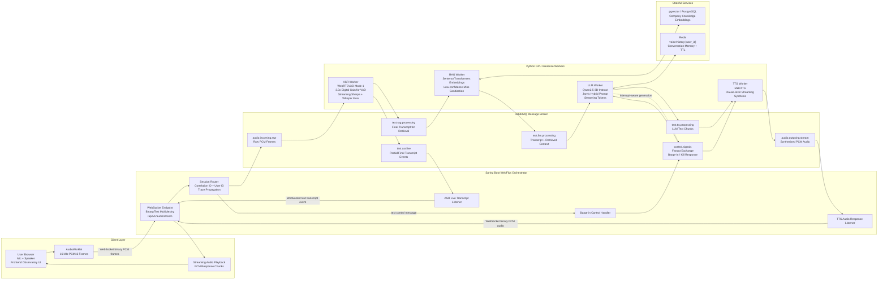

# JarvisLabs Real-Time Voice Assistant

JarvisLabs Real-Time Voice Assistant is an end-to-end spoken AI assistant built with open models. A user speaks into the browser, the system streams audio through ASR, retrieves company knowledge when useful, reasons with Qwen, and streams synthesized speech back to the browser.

## Architecture

## Runtime Components

- Browser frontend streams microphone PCM frames over WebSocket and plays response PCM audio.
- Spring Boot WebFlux orchestrator multiplexes binary audio, transcript events, response audio, and barge-in control messages.
- RabbitMQ decouples audio ingress, ASR live transcripts, RAG requests, LLM chunks, TTS synthesis, response audio, and interruption signals.
- Python GPU workers run ASR, RAG, LLM, and TTS independently.
- pgvector stores embedded company knowledge for grounded support answers.
- Redis stores conversation history as `voice:history:{user_id}` with TTL-backed memory.
